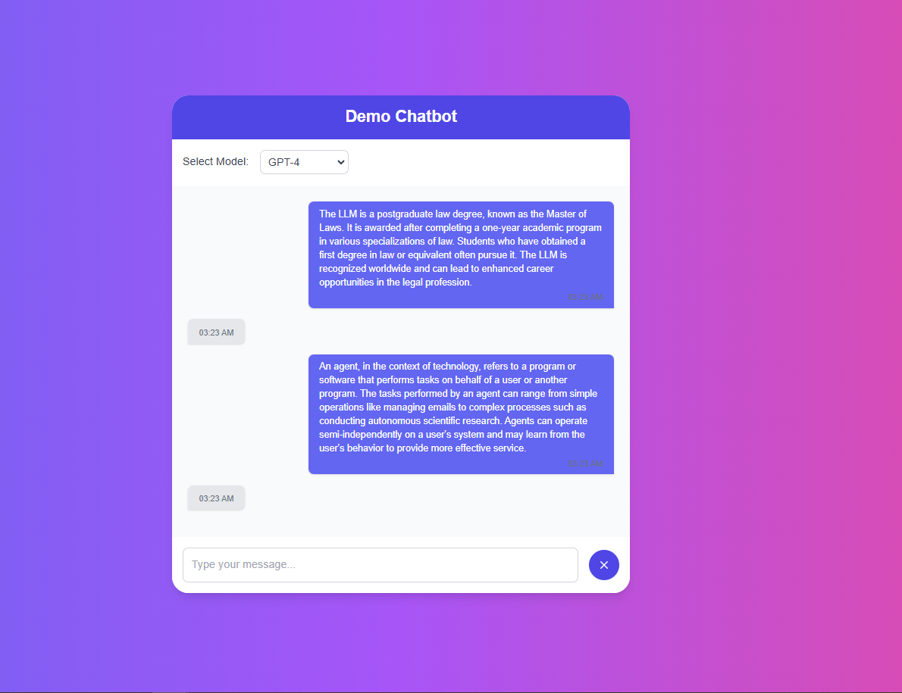

# The Next Bot

This is a Demo chatbot using Vercel AI SDK along with OpenAI

A feature-rich chatbot application built with Next.js and Tailwind CSS, leveraging OpenAI's powerful language models. Users can interact with the chatbot using different AI models, including GPT-4, GPT-4o-mini, and O1, to tailor responses based on their specific needs.

## Features

- **Multiple AI Model Selection:** Choose between GPT-4, GPT-4o-mini, and O1 to customize the chatbot's responses.
- **Responsive Design:** Built with Tailwind CSS to ensure a seamless experience across all devices.
- **Typing Animation:** Realistic typing effect simulating human-like responses.
- **Dark Mode Support:** Toggle between light and dark themes for user comfort.
- **Error Handling:** Informative error messages for better user feedback.
- **Model Information:** Brief descriptions of each AI model to help users make informed choices.
- **Persistent Settings:** Remembers user preferences for model selection across sessions.

## Demo



## Technologies Used
- **[Vercel AI SDL](https://sdk.vercel.ai/docs/introduction)** Vercel AI SDK for Openai integration
- **[Next.js](https://nextjs.org/):** React framework for building server-side rendered applications.
- **[Tailwind CSS](https://tailwindcss.com/):** Utility-first CSS framework for rapid UI development.
- **[OpenAI API](https://openai.com/api/):** Language models powering the chatbot's intelligence.
- **[DOMPurify](https://github.com/cure53/DOMPurify):** Library for sanitizing HTML to prevent XSS attacks.

## Getting Started

Follow these instructions to set up and run the project on your local machine.

### Prerequisites

- **Node.js:** Ensure you have Node.js installed. You can download it from [here](https://nodejs.org/).
- **OpenAI API Key:** Obtain an API key from [OpenAI](https://platform.openai.com/account/api-keys).

### Installation

1. **Clone the Repository:**

```bash
git clone https://github.com/Altruy/the-next-bot.git
cd the-next-bot
```
2. **Run the App**
  ```
  npm run dev
  ```
